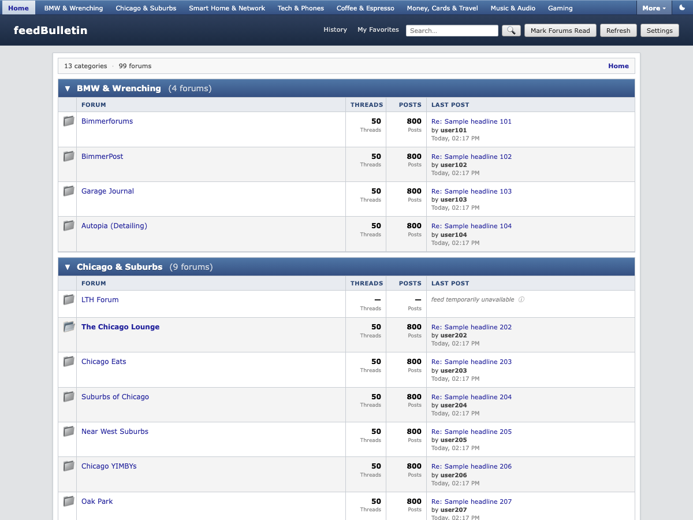
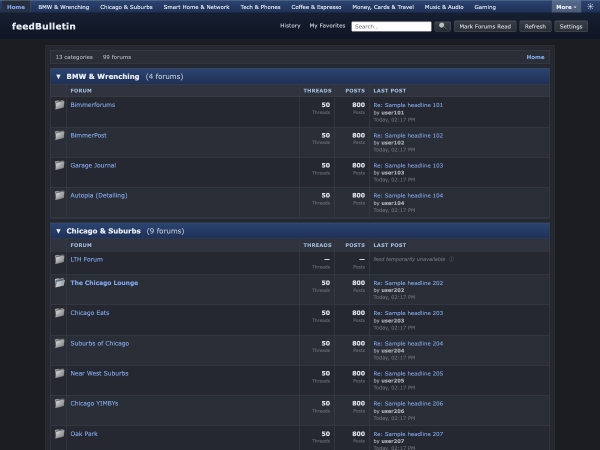
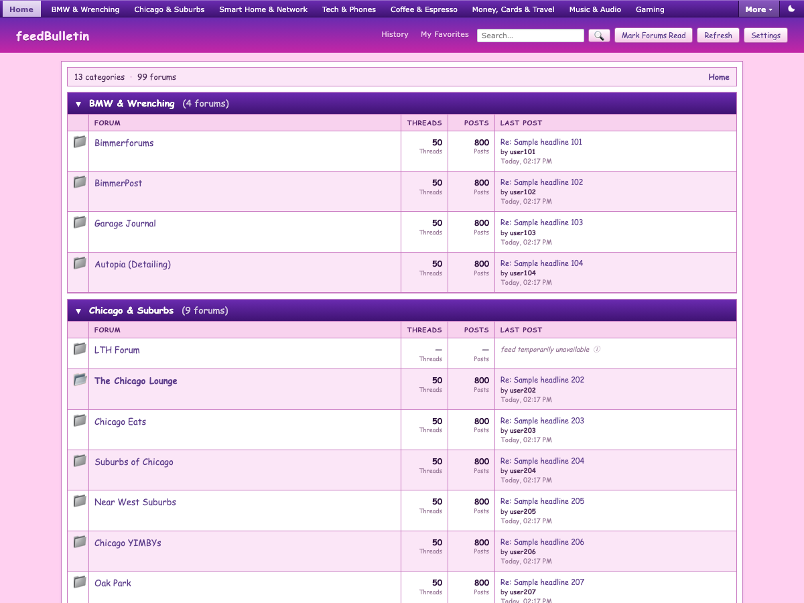
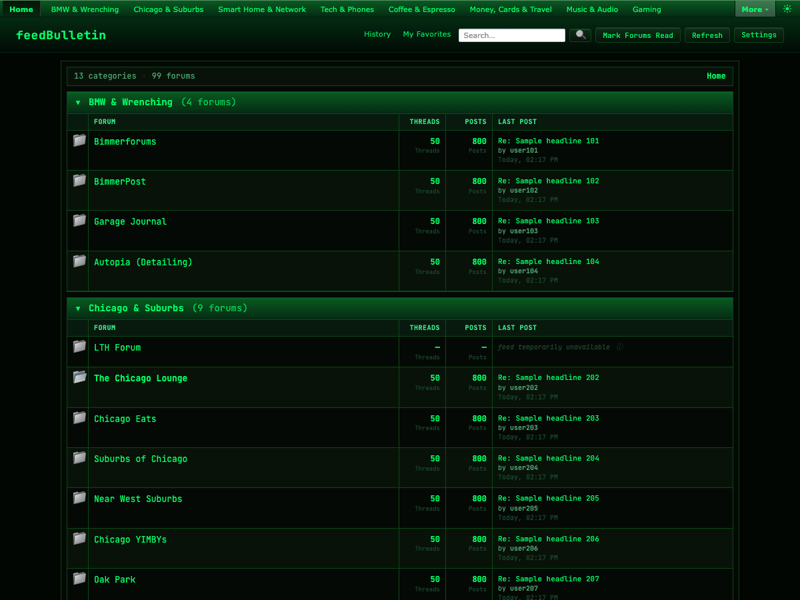
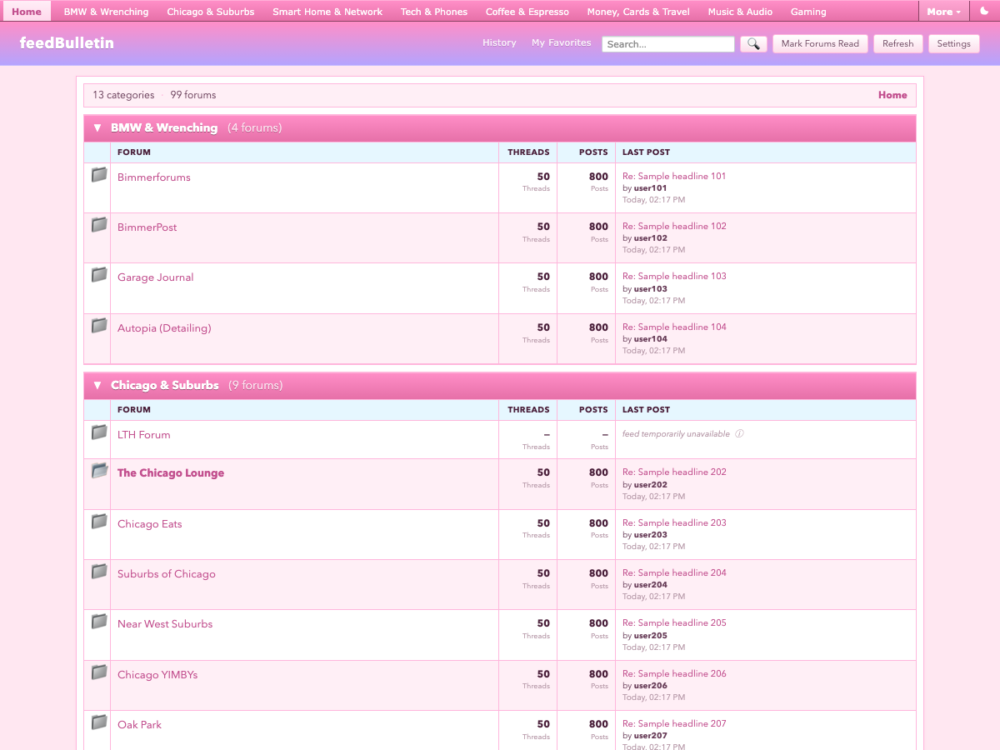
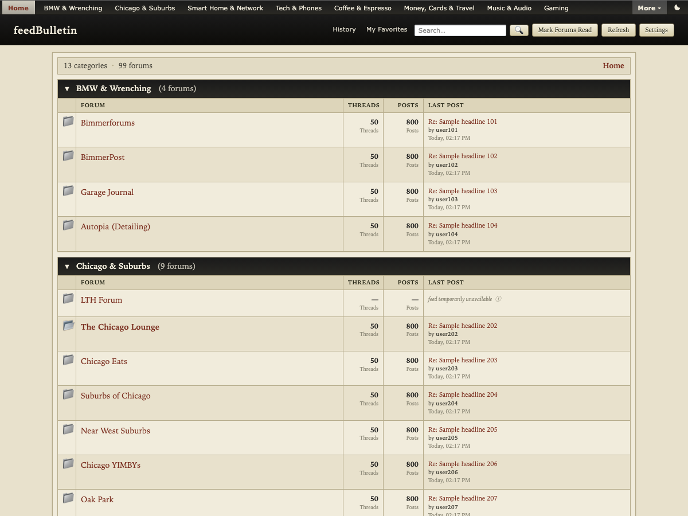
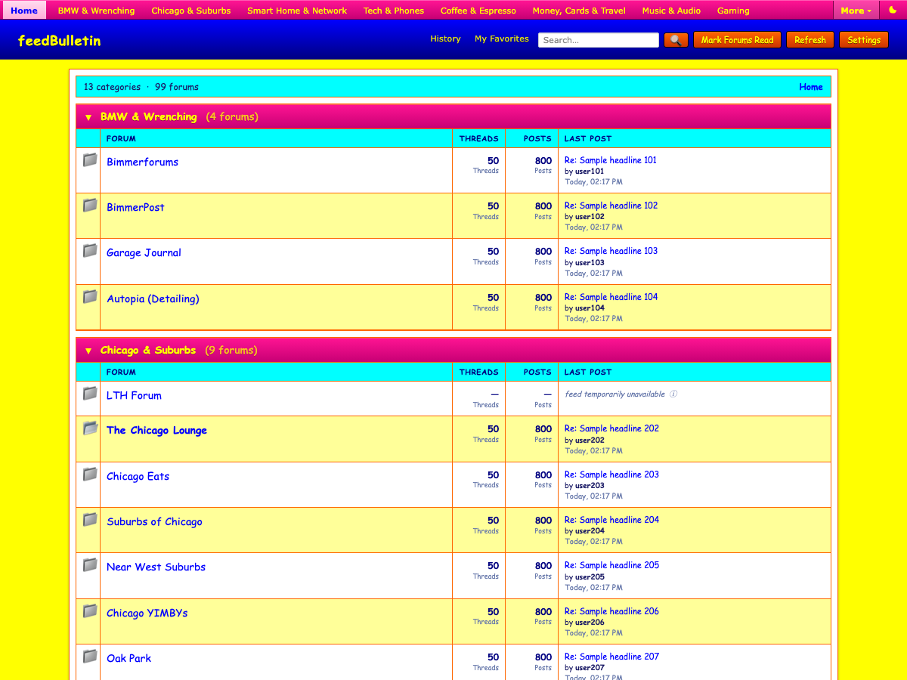
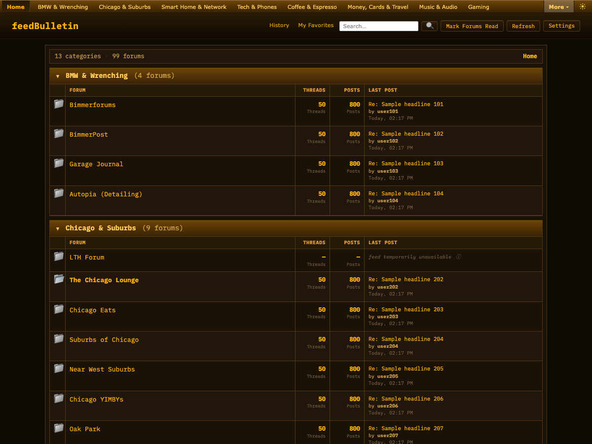
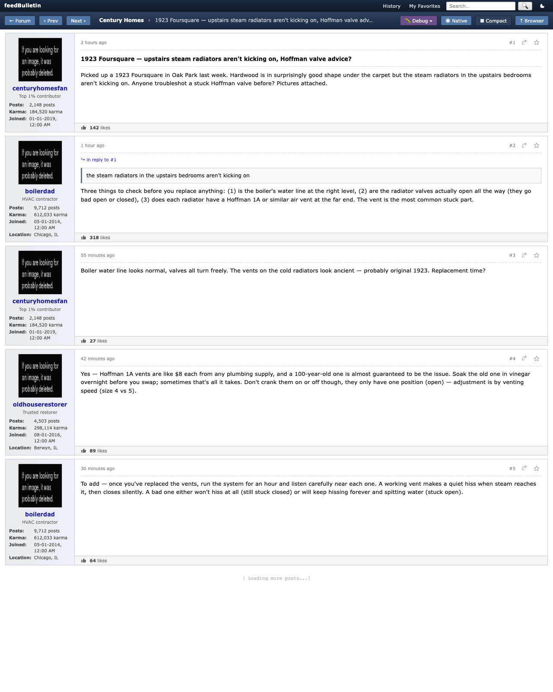

# feedBulletin

> A native, themable, vBulletin-style aggregator for Reddit and the forums that still matter.

feedBulletin is an open-source desktop app that turns your scattered forum-hopping
into a single dense, fast, **2012-vBulletin-style index**. Reddit subreddits and
classic forum RSS feeds (XenForo, vBulletin, Discourse, phpBB, SMF, IPB, Ubiquiti)
sit side-by-side in one window — with native rendering, learned-once selectors,
avatar enrichment, full-text search, and **17 user-switchable themes** that range
from a faithful vB4 reproduction to GeoCities, Matrix Rain, MySpace 2006, Bubblegum,
and beyond.

Built on [Tauri 2](https://tauri.app/) (Rust core) + [SvelteKit 5](https://kit.svelte.dev/).
Runs on macOS, Windows, and Linux as a real desktop app — not a web view in a fancy
hat.

---

## Theme gallery

Every interface element resolves through ~60 CSS custom properties; each skin is a
single palette swap that propagates across the entire UI. Light and dark variants
for all 17 skins; OS-preference followed by default, or pick a mode manually.

| | | |
|---|---|---|
|  |  |  |
| **vb-classic** — 2012 vBulletin v4 default | **vb-classic dark** — the same, after sundown | **myspace-2006** — purple/magenta, Comic Sans |
|  |  |  |
| **matrix-rain** — hacker green-on-black | **bubblegum** — pastel pinks + lavender | **letterpress-paper** — NYT/FT broadsheet |
|  |  | + **9 more** in the picker |
| **geocities-90s** — primary chaos | **bbs-amber** — vintage modem terminal | bbs-green · slashdot-classic · phpbb-prosilver · livejournal-cozy · zine-riot · brutalist-mono · vaporwave · earthtones · tactical-od · blueprint |

Pick site-wide via **Settings → Theme**. Hover any option to preview live across the
whole app; click to mark as pending; **Save** to commit. You can also pin a theme
to an individual forum in `feeds.yaml` (`theme: matrix-rain`) — that override
applies whenever you're inside that forum or any thread it owns.

---

## Native thread rendering with avatar enrichment

feedBulletin doesn't iframe forum threads. The Rust core scrapes each post using
**per-host learned CSS selectors**, then re-renders them in a clean, dense vB4
layout — same author column, avatars, rank, post count, join date, location, and
karma every classic forum exposed. The agent learns each new host once on first
visit (using your Anthropic API key — see prerequisites below); subsequent visits
read from the local cache.



> A live thread from `r/centuryhomes`, rendered natively. Every author has been
> enriched with avatar (or a deterministic geopattern fallback when the source
> didn't provide one), rank, post count, join date, karma, and location pulled
> from the user's profile. Quote blocks resolve to their parent post and clip
> back to it on click.

---

## Features

- **One window, ~80 forums.** Reddit subs, Reddit user feeds, XenForo, vBulletin, Discourse, phpBB, SMF, IPB, Ubiquiti, generic RSS — all in the vB4 layout you remember.
- **Native render with learned selectors.** Open a thread and read it in the same chrome as the index, with avatars, signatures, quotes, sidebar metadata. No iframes.
- **Author enrichment.** Each unique author's profile is fetched once and patched onto every post they appear in — avatar, rank, post count, join date, location, karma. Cached forever per (host, username).
- **17 themes, 2 modes each.** Site-wide pick lives in localStorage; per-forum override lives in YAML. Hover-to-preview dropdown.
- **Hot vs New sort** where the source supports it (Reddit `score`, XenForo reply count, Discourse posts).
- **Full-text search** powered by SQLite FTS5 across every poll.
- **Favorites and history** — per-post star, per-thread visit log.
- **Mark-as-read** on visit, with bold-row unread indication.
- **Keyboard-first navigation.** `j`/`k` between rows, `Enter` opens, `⌘+`/`⌘-` zoom, browser-style.
- **Trackpad pinch zoom** and persistent `localStorage`-backed zoom level.
- **Visual debugger.** When a selector misses, click a button and the Anthropic agent refines against the live DOM. All revisions are versioned in SQLite with undo.
- **AI Wizard.** Converse with the assistant inside Settings to add/remove feeds and theme overrides without hand-editing YAML.
- **Bundled site profiles.** Selectors for `e90post.com`, `garagejournal.com`, `xdaforums.com`, and `community.ui.com` ship in the binary so your first thread opens without a learner call.

---

## Prerequisites

### Anthropic API key (required for new-host learning)

feedBulletin uses Claude to **learn each new forum host's selectors** the first
time you open a thread on it. This is a one-shot per (host, content-type) call;
results are cached in SQLite and reused forever. The visual debugger uses the
same API to refine selectors when something looks wrong.

The four most-popular hosts ship pre-learned in the binary — **first thread on
any of those opens without an API call** — but anything outside that set will
prompt the learner on first visit.

Set the key before launching the app:

```sh
# macOS / Linux
export ANTHROPIC_API_KEY="sk-ant-…"

# Windows (PowerShell)
$env:ANTHROPIC_API_KEY = "sk-ant-…"
```

> **You can use feedBulletin without an API key** — the feed-index view, search,
> favorites, history, and the source-site WebView render all work fine. You just
> won't get native thread rendering for hosts that aren't already pre-learned.
> The app degrades gracefully: it falls back to the embedded WebView for any
> host it can't render natively.

Get an API key at <https://console.anthropic.com/settings/keys>. The learner
spends roughly $0.01–0.03 per new host on first visit; refinement passes are in
the same ballpark.

### Build-time

- **macOS**: Xcode Command Line Tools (`xcode-select --install`)
- **Windows**: Visual Studio 2022 Build Tools (Desktop development with C++) + WebView2 runtime (Edge 80+ ships with it)
- **Linux**: `libwebkit2gtk-4.1-dev`, `libgtk-3-dev`, `libsoup-3.0-dev`, build essentials. Ubuntu 22.04+ recommended; the AppImage in releases avoids most distro-pinning headaches.
- **All platforms**: Rust 1.78+ ([rustup](https://rustup.rs/)), Node 22+, pnpm 9+.

---

## Install

### Pre-built binaries (recommended)

Download the matching installer from the [latest release](https://github.com/312-dev/feedbulletin/releases/latest):

| Platform | File |
|---|---|
| macOS (Apple Silicon) | `feedBulletin_<ver>_aarch64.dmg` |
| macOS (Intel) | `feedBulletin_<ver>_x64.dmg` |
| Windows x86_64 | `feedBulletin_<ver>_x64-setup.exe` (NSIS) or `feedBulletin_<ver>_x64_en-US.msi` |
| Linux x86_64 | `feedBulletin_<ver>_amd64.AppImage` or `feedBulletin_<ver>_amd64.deb` |

macOS users: until we sign and notarize, you'll need to right-click → Open the
first time to get past Gatekeeper. We're working on it.

### Build from source

```sh
git clone https://github.com/312-dev/feedbulletin.git
cd feedbulletin
pnpm install
pnpm tauri build       # produces a release bundle for your host platform
```

The artifact lands under `src-tauri/target/release/bundle/`. For day-to-day
hacking use `pnpm tauri dev` instead — it gives you hot reload and a real Rust
process.

See [DEVELOPMENT.md](DEVELOPMENT.md) for platform-specific notes (including the
`cc`-shadowing macOS quirk).

---

## Configuration: `feeds.yaml`

feedBulletin reads `feeds.yaml` from the project root in dev, or from the
platform's app-data directory in production:

- macOS: `~/Library/Application Support/com.grayada.forumreader/feeds.yaml`
- Windows: `%APPDATA%\com.grayada.forumreader\feeds.yaml`
- Linux: `~/.config/com.grayada.forumreader/feeds.yaml`

### Schema

```yaml
categories:
  - name: <category name>          # required; unique
    forums:
      - kind: <reddit|xenforo|vbulletin|discourse|phpbb|smf|ipb|ubiquiti|generic_rss>
        title: <display name>      # optional; auto-derived if missing
        url: <RSS / JSON feed URL> # required for non-reddit kinds
        sub: <subreddit name>      # reddit-only; mutually exclusive with `user`
        user: <reddit username>    # reddit-only; mutually exclusive with `sub`
        description: <short text>  # optional; shown under the title
        poll_interval_s: 1800      # optional; defaults to 1800 (30 min)
        theme: <skin slug>         # optional; overrides site-wide for this forum
        disabled: false            # optional; defaults to false
```

### Examples

```yaml
categories:
  - name: BMW & Wrenching
    forums:
      - kind: vbulletin
        title: E90 Post
        url: https://www.e90post.com/forums/external.php?type=RSS2
        # No theme set → site-wide pick wins.

      - kind: reddit
        sub: BMW
        theme: tactical-od
        # Any thread opened from this forum will use the tactical-od skin.

  - name: Chicago
    forums:
      - kind: reddit
        sub: chicago
        theme: myspace-2006

      - kind: reddit
        user: spez
        title: u/spez
```

### Available theme slugs

`vb-classic`, `phpbb-prosilver`, `slashdot-classic`, `myspace-2006`,
`livejournal-cozy`, `geocities-90s`, `bbs-amber`, `bbs-green`, `matrix-rain`,
`letterpress-paper`, `zine-riot`, `brutalist-mono`, `vaporwave`, `earthtones`,
`bubblegum`, `tactical-od`, `blueprint`.

Each has a built-in light and dark palette; current mode is shared across all
skins.

### Best practices

- **`poll_interval_s` ≥ 60.** Most forums rate-limit aggressively below 1 minute; many will start returning 403 / 429 after a few aggressive pulls. The default 1800 (30 min) is what we run with in production. Reddit is the harshest: don't drop below 300.
- **Use `disabled: true` to mute, don't delete.** A deleted entry is pruned from the DB on next start; a disabled entry stays in place so re-enabling it doesn't lose your read state.
- **One title per category.** Titles must be unique within a category (it's the DB upsert key).
- **Reddit Accept header is exact.** If you're proxying through anything that adds an `Accept: application/rss+xml` header, Reddit will return 403. Don't.
- **Cloudflare-protected forums** (LTHForum is the classic) will respond 403 to the Rust HTTP client regardless of UA. They show up in the index with a status pill explaining what happened.

The Settings page validates `feeds.yaml` live — errors block save, warnings don't.
**You must restart feedBulletin after editing feeds.yaml** for poller changes to
take effect (the AI Wizard does this for you).

---

## Documentation

- [DEVELOPMENT.md](DEVELOPMENT.md) — local dev setup, platform quirks
- [CONTRIBUTING.md](CONTRIBUTING.md) — how to contribute, branch strategy, PR policy
- [SECURITY.md](SECURITY.md) — how to report vulnerabilities
- [`src-tauri/src/scrape/seed_profiles/`](src-tauri/src/scrape/seed_profiles/) — the bundled site profiles (one MD per host) and how to add your own

---

## License

[MIT](LICENSE). See the LICENSE file for the full text.

## Acknowledgements

- The [Tauri](https://tauri.app/) team for making it actually pleasant to ship Rust desktop apps.
- The classic-forum culture this is a love letter to — vBulletin, XenForo, phpBB, BBS communities, the lot.
- Anthropic for the Claude API that powers the selector learner.
